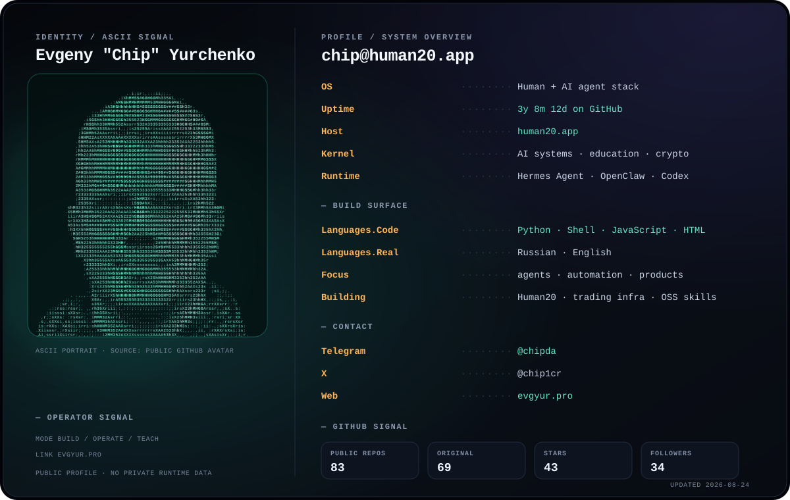

  

  <a href="https://human20.app">human20.app</a> ·
  <a href="https://evgyur.pro">evgyur.pro</a> ·
  <a href="https://t.me/chipda">Telegram</a> ·
  <a href="https://x.com/chip1cr">X</a>

 

### Selected systems

- [`server-doctor-public`](https://github.com/evgyur/server-doctor-public) — update and recover OpenClaw instances.
- [`Hermes-powerpack`](https://github.com/evgyur/Hermes-powerpack) — public Hermes Agent distribution for workshops.
- [`chip-supergoal`](https://github.com/evgyur/chip-supergoal) — plan-only SuperGoal workflow with review gates.
- [`crypto-price`](https://github.com/evgyur/crypto-price) — crypto prices and candlestick charts for agents.

The terminal card is generated from public GitHub data. No private repository or runtime information is included.
